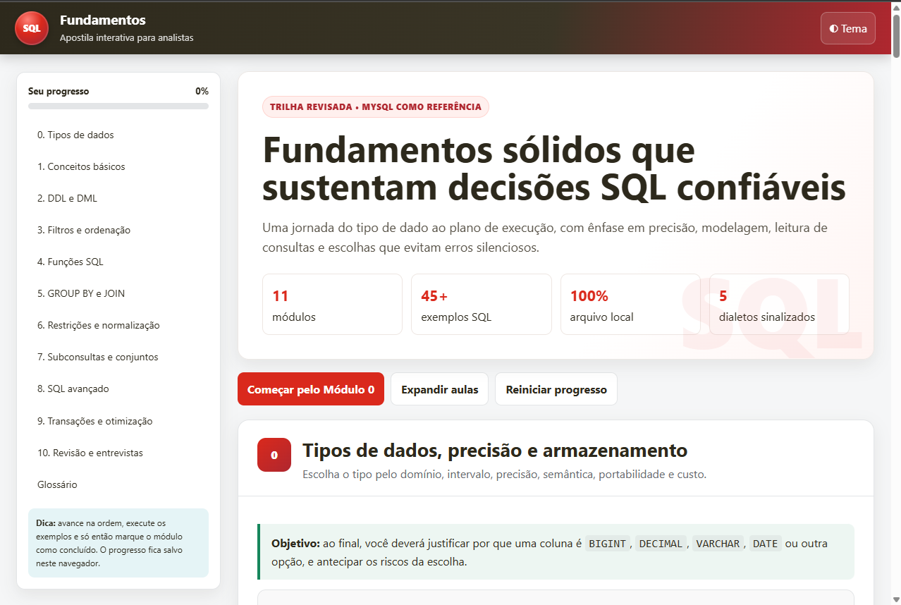
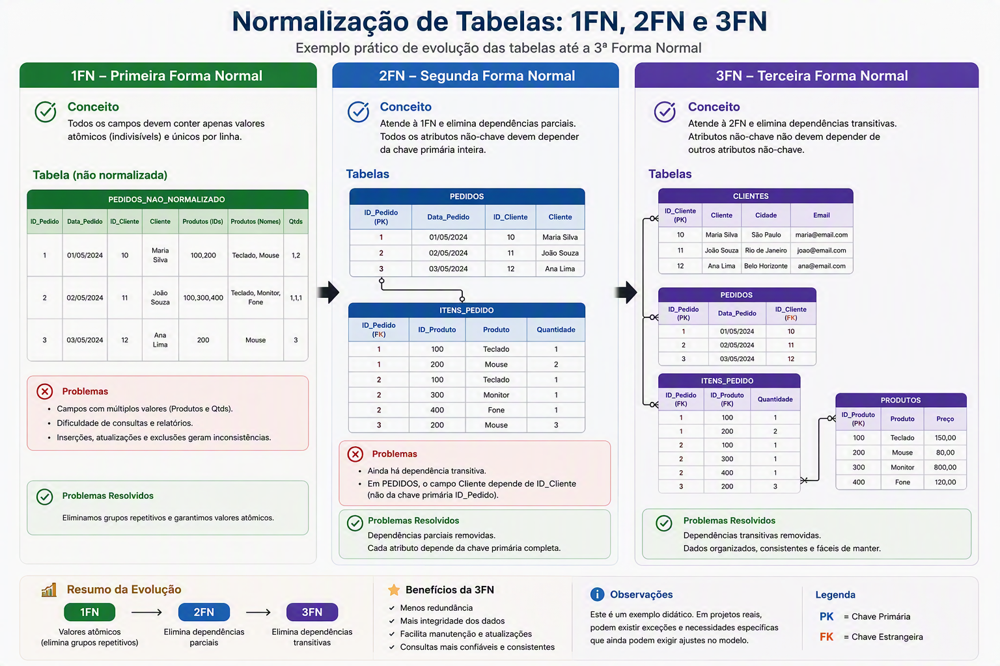

<div align="center">

---
<p align="center">
  

[](LICENSE)
</div>

---

# SQL Fundamentos: Apostila Interativa

Apostila interativa de fundamentos de SQL, desenvolvida para profissionais que já utilizam a linguagem no dia a dia e desejam reforçar as decisões básicas que sustentam consultas, modelos e análises confiáveis.

O projeto reorganiza uma apostila originalmente distribuída em PDF em uma experiência de aprendizagem responsiva, navegável e autônoma. Todo o conteúdo, o estilo e as interações estão concentrados em um único arquivo HTML, sem necessidade de backend ou instalação.

> **Fundamentos sólidos que sustentam decisões SQL confiáveis.**


## Demonstração

Abra o arquivo `index.html` = `sql_fundamentos_apostila_interativa` diretamente no navegador.


## Objetivo

Este material foi pensado para analistas e profissionais de dados que já trabalham com SQL, mas desejam revisar os critérios fundamentais usados em tarefas como:

- escolher tipos de dados adequados;
- preservar precisão numérica;
- diferenciar identificadores de quantidades;
- aplicar filtros e agregações corretamente;
- compreender cardinalidade em junções;
- evitar conversões implícitas;
- modelar restrições e relacionamentos;
- usar transações e níveis de isolamento;
- analisar consultas e decisões de desempenho.

A proposta não é somente apresentar sintaxe. Cada módulo busca explicar **por que uma escolha é adequada**, quais riscos existem e quando o comportamento varia entre sistemas gerenciadores de banco de dados.

## Principais funcionalidades

- Navegação por módulos em menu lateral;
- Navegação adaptada para celular e tablet;
- Modo claro e modo escuro;
- Progresso salvo no `localStorage` do navegador;
- Marcação de módulos concluídos;
- Aulas expansíveis;
- Blocos SQL com botão para copiar;
- Quiz com feedback imediato;
- Calculadora de faixa para tipos inteiros;
- Calculadora de precisão e escala para `DECIMAL(p,s)`;
- Glossário de consulta rápida;
- Layout responsivo;
- Impressão otimizada em A4 paisagem;
- Funcionamento local, sem backend;
- Ausência de dependências externas em tempo de execução.

## Conteúdo

### Módulo 0: Tipos de dados, precisão e armazenamento

O módulo inicial foi criado para reforçar decisões frequentemente tratadas como detalhes de implementação, mas que afetam integridade, desempenho e interoperabilidade.

Tópicos abordados:

- método de escolha de tipos por domínio, faixa e semântica;
- `TINYINT`, `SMALLINT`, `MEDIUMINT`, `INT` e `BIGINT`;
- diferença entre `BIGINT` e `BIGINT UNSIGNED`;
- limites numéricos e armazenamento em bytes;
- portabilidade de `UNSIGNED`;
- limite de inteiros seguros no JavaScript;
- precisão e escala em `DECIMAL(p,s)`;
- diferenças entre `DECIMAL`, `FLOAT` e `DOUBLE`;
- motivo para não usar `FLOAT(12,2)` como garantia de precisão;
- representação de valores monetários;
- `CHAR`, `VARCHAR` e tipos `TEXT`;
- Unicode, `utf8mb4` e collations;
- CPF, CNPJ, CEP, telefone e outros identificadores textuais;
- `DATE`, `TIME`, `DATETIME` e `TIMESTAMP`;
- horário local, fuso horário e UTC;
- `BOOLEAN`, `TINYINT(1)` e restrições `CHECK`;
- tipos binários, UUID, JSON e `ENUM`;
- diferenças entre `NULL`, string vazia, zero e texto contendo zero;
- conversões implícitas;
- compatibilidade entre chaves primárias e estrangeiras;
- impacto dos tipos em índices e desempenho.

### Módulo 1: Conceitos básicos

- Banco de dados;
- SGBD e SGBDR;
- SQL como linguagem;
- diferenças entre SQL e produtos como MySQL e PostgreSQL;
- famílias DDL, DML, DQL, DCL e TCL.

### Módulo 2: Criação e manipulação de dados

- `CREATE`;
- `ALTER`;
- `DROP`;
- `TRUNCATE`;
- `INSERT`;
- `UPDATE`;
- `DELETE`;
- diferenças entre comandos destrutivos.

### Módulo 3: Consultas, filtros e ordenação

- `SELECT`;
- `WHERE`;
- `DISTINCT`;
- `ORDER BY`;
- `BETWEEN`;
- `IN`;
- `LIKE`;
- `IS NULL`;
- aliases;
- `LIMIT` e diferenças de dialeto.

### Módulo 4: Funções SQL

- funções de agregação;
- funções de texto;
- funções numéricas;
- funções de data e hora;
- tratamento de valores nulos;
- diferença entre `COUNT(*)` e `COUNT(coluna)`.

### Módulo 5: Agrupamento e junções

- `GROUP BY`;
- `WHERE` versus `HAVING`;
- `INNER JOIN`;
- `LEFT JOIN`;
- `RIGHT JOIN`;
- `FULL OUTER JOIN`;
- `SELF JOIN`;
- `CROSS JOIN`;
- riscos de duplicação e perda de linhas.

### Módulo 6: Restrições e normalização

- `PRIMARY KEY`;
- `FOREIGN KEY`;
- `UNIQUE`;
- `NOT NULL`;
- `CHECK`;
- `DEFAULT`;
- Primeira Forma Normal 1FN;
- Segunda Forma Normal 2FN;
- Terceira Forma Normal 3FN;
- BCNF;
- normalização e desnormalização deliberada.

---

<p align="center">
  
</p>

---

### Módulo 7: Subconsultas e operadores de conjunto

- subconsulta escalar;
- subconsulta com múltiplas linhas;
- subconsulta correlacionada;
- `EXISTS` e `NOT EXISTS`;
- `UNION`;
- `UNION ALL`;
- `INTERSECT`;
- `EXCEPT`.

### Módulo 8: SQL avançado

- views;
- índices;
- CTEs;
- funções de janela;
- `ROW_NUMBER`;
- `RANK`;
- `DENSE_RANK`;
- `LEAD` e `LAG`;
- `CASE WHEN`;
- conceitos de pivot e unpivot.

### Módulo 9: Transações e desempenho

- propriedades ACID;
- `COMMIT`;
- `ROLLBACK`;
- `SAVEPOINT`;
- problemas de concorrência;
- níveis de isolamento;
- índices;
- `EXPLAIN`;
- princípios de otimização.

### Módulo 10: Revisão e entrevistas

- checklist para construção de consultas;
- perguntas fundamentais;
- desafios práticos;
- revisão de tipos, junções, agregações e funções de janela;
- cuidados com casos extremos e desempenho.

## Tecnologias utilizadas

O projeto utiliza somente tecnologias nativas da Web:

- HTML5;
- CSS3;
- JavaScript;
- `localStorage` para persistência do progresso;
- `IntersectionObserver` para acompanhamento da navegação;
- API de Clipboard para copiar exemplos SQL;
- recursos nativos de impressão do navegador.

Não há framework, gerenciador de pacotes, banco de dados ou etapa de compilação.


## Como executar localmente

### Forma mais simples

1. Faça o download ou clone o repositório;
2. Localize o arquivo `index.html`;
3. Abra o arquivo com um navegador moderno.

Nenhum servidor é necessário.


## Uso da apostila

1. Comece pelo Módulo 0;
2. Expanda cada aula para consultar os exemplos;
3. Use as calculadoras para revisar faixas e precisão;
4. Copie as consultas e execute em um ambiente de estudos;
5. Responda aos quizzes;
6. Marque o módulo como concluído;
7. Use a busca para retornar rapidamente a um conceito;


O progresso é armazenado no navegador. Se os dados do site forem apagados ou a apostila for aberta em outro navegador, o progresso não será transferido automaticamente.

## Compatibilidade

A interface foi projetada para navegadores modernos, incluindo:

- Microsoft Edge;
- Google Chrome;
- Mozilla Firefox;
- Safari.

Alguns recursos, como acesso à área de transferência, podem variar conforme as permissões do navegador e o modo de abertura do arquivo.

## Referência de dialeto SQL

Os exemplos utilizam **MySQL como referência principal**, especialmente nas partes relacionadas a:

- `UNSIGNED`;
- `MEDIUMINT`;
- `TINYINT(1)`;
- `LIMIT`;
- `DATETIME`;
- collations `utf8mb4`.

O material sinaliza diferenças relevantes, mas não substitui a documentação oficial da versão utilizada.

Antes de aplicar um exemplo em produção, verifique a sintaxe e o comportamento no ambiente correspondente:

- MySQL;
- PostgreSQL;
- Microsoft SQL Server;
- Oracle Database;
- SQLite;
- outros SGBDs e plataformas analíticas.

## Decisões técnicas e pedagógicas

- O conteúdo foi reorganizado em uma sequência progressiva;
- Fundamentos de tipos de dados aparecem antes dos comandos SQL;
- Exemplos priorizam legibilidade e intenção;
- Afirmações dependentes de SGBD são apresentadas com ressalvas;
- Comandos destrutivos recebem alertas visuais;
- O material diferencia regras universais de decisões dependentes do domínio;
- A interface evita dependência de serviços externos;
- O conteúdo pode ser impresso, mas a experiência principal é digital e interativa.

## Limitações

- A apostila não executa consultas SQL no navegador;
- Os exemplos não representam todos os comportamentos de todos os SGBDs;
- O quiz atual não substitui avaliação prática;
- O progresso é local e não possui sincronização entre dispositivos;
- O projeto não possui autenticação, backend ou banco de dados;
- A impressão pode apresentar pequenas diferenças entre navegadores;
- Exemplos devem ser adaptados às regras e ao volume de cada ambiente.

## Como contribuir

Contribuições são bem-vindas, principalmente para:

- corrigir conceitos ou exemplos;
- documentar diferenças entre dialetos;
- melhorar acessibilidade;
- propor novos exercícios;
- revisar conteúdo em português do Brasil;
- testar o comportamento em diferentes navegadores;
- melhorar impressão e responsividade.

Fluxo sugerido:

1. Crie um fork do repositório;
2. Crie uma branch descritiva;
3. Faça alterações pequenas e focadas;
4. Teste o HTML em desktop e celular;
5. Verifique exemplos SQL no dialeto indicado;
6. Abra um Pull Request explicando a mudança.

Exemplo:

```bash
git checkout -b docs/melhora-modulo-tipos
git add .
git commit -m "docs: melhora explicacao sobre tipos numericos"
git push origin docs/melhora-modulo-tipos
```

## Padrão de commits sugerido

O projeto pode utilizar Conventional Commits:

```text
feat: adiciona novo recurso
fix: corrige comportamento ou conteúdo
content: adiciona ou revisa conteúdo didático
docs: atualiza documentação
style: altera apresentação sem mudar comportamento
refactor: reorganiza código sem alterar funcionalidade
test: adiciona ou altera testes
chore: manutenção geral
```

## Segurança e uso responsável

Os exemplos SQL são educacionais. Antes de executar comandos em ambientes reais:

- trabalhe em uma base de testes;
- revise filtros de `UPDATE` e `DELETE`;
- valide a quantidade de linhas afetadas;
- utilize transações quando apropriado;
- mantenha backups e estratégias de recuperação;
- respeite políticas de acesso e proteção de dados;
- não publique dados reais, credenciais ou informações sensíveis no repositório.

## Licença

MIT License — see [LICENSE](LICENSE) for details.


## Agradecimentos

Este projeto valoriza o princípio de que consultas confiáveis, modelos coerentes e análises precisas começam pela aplicação consistente dos fundamentos.\
Como inspiração [Lucas Araújo](https://www.linkedin.com/in/lucas-engenharia/) `muito obrigado por compartilhar conhecimentos`,


## Autor

Projeto reformulado para uma experiência digital interativa.\
Feito com ❤️ por Rafael Silva
